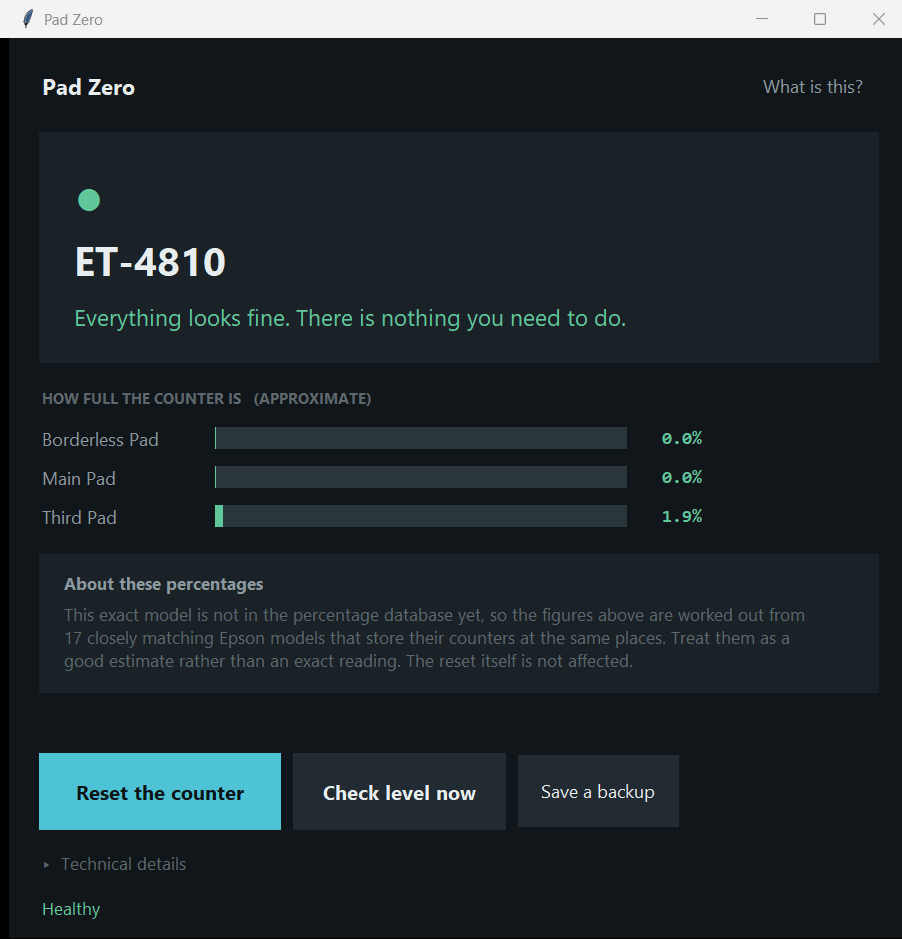
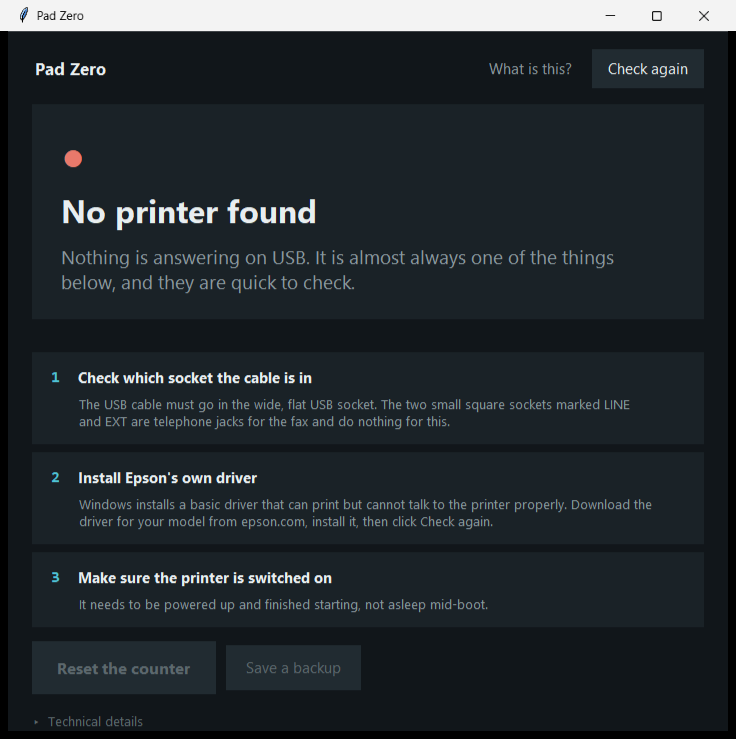

# Pad Zero

Your Epson stopped printing and says something about **ink pads** or
**service required**? This fixes that in about five minutes.

Free, open source, no paid tier, no nag screens.

**→ [Start here: Quick start guide](QUICKSTART.md)**



If nothing is plugged in, it tells you what to check rather than showing an
error:



---

## Read this first

**This will not empty your waste ink pads.**

Your printer keeps a counter estimating how much waste ink has soaked into
the absorbent pads inside it. There is no sensor. It's an estimate that
climbs every time the printer cleans its head, charges ink, powers on, or
prints borderless. When the estimate crosses a threshold, the printer stops
printing and tells you to contact Epson.

This tool sets that counter back to zero. That is the whole of what it does.

The ink is still in the pads. If they were genuinely saturated, resetting
means the printer keeps pumping ink into full foam, and eventually that ink
weeps out of the bottom onto whatever the printer is sitting on.

**Reset the counter to get printing again, then fix it properly.** Replace
the pad, or fit an external waste tank. Both are cheap and widely available.
Put something absorbent under the printer in the meantime.

---

## Download

Go to the [Releases page](../../releases) and download **`PadZero.exe`**.

That's the one you want. Double-click it, a window opens, done. No installer,
no Python, nothing to set up, run it from anywhere.

The other file, `padzero-cli.exe`, is the same tool for the command line. If
you're not sure whether you want it, you don't.

Windows will likely show **"Windows protected your PC"**, because the binary
is unsigned and counter-resetting is exactly the behaviour antivirus
heuristics look for. Click *More info*, then *Run anyway*. Or verify the
SHA-256 published with each release. Or build it from source yourself, below.

---

## What the window shows

A coloured dot and a plain sentence:

| Dot | Meaning |
|---|---|
| Green | Everything is fine. Nothing to do. |
| Amber | Getting full. The printer will stop soon. |
| Red | Full. This is why it stopped printing. |

Under that, a bar per counter showing how full it is, and one button to reset.
Anything technical (key groups, EEPROM addresses, raw byte values) is tucked
behind a **Technical details** panel that starts closed.

---

## Requirements

Two things, and they cause almost every "it doesn't work" report:

1. **Epson's own printer driver installed.** Windows' generic driver is
   enough to print but not enough to talk to the printer. Without it, this
   tool and every other reset tool will say they can't find your printer.
2. **The USB cable in the printer's USB port.** Not `LINE` or `EXT`, which
   are the fax telephone jacks.

Windows only, for now. Linux users can use
[reinkpy](https://codeberg.org/atufi/reinkpy) directly.

---

## Will it work on my printer?

**[Check the coverage list](COVERAGE.md)** and search for your model.

**1,423 Epson models can be reset.** Some also show a percentage, some
don't, but that part is cosmetic: the reset is what gets your printer
printing again.

## Model coverage

Neither upstream database covers every printer, so the tool reports what it
actually knows rather than guessing:

| Coverage | Meaning |
|---|---|
| `full` | percentages and reset both available, from this model's own data |
| `approx` | reset available; percentages estimated from models that store their counters at the same addresses, and labelled as approximate |
| `partial` | reset available; no percentages could be worked out |
| `none` | read-only. The tool refuses to write to a model it doesn't know |

`approx` exists because "1 stored value" is not an answer to "how full is
it". The estimate is only used when models sharing this printer's reset
addresses agree unanimously on a layout, and any counter reading an address
absent from this model's own reset map is dropped rather than shown as a
confident 0%. A divider only scales a number on screen and is never written
to the printer, so a wrong estimate misinforms but cannot damage anything.

Verified on real hardware:

| Model | Key group | Coverage | Status |
|---|---|---|---|
| ET-4800 | `0x364A` | full | reset verified 79.85% to 0.00% |
| ET-4810 | `0x574B` | approx | detected, read, write path verified |

`models.json` carries data for 110 models, but **listed is not the same as
verified**. If yours works, please open an issue and say so. That's how this
table grows.

### Adding your printer

If it reports `coverage: none`, click **Save a backup** in the window (or run
`padzero-cli --dump`) and open an [issue](../../issues) with the file and your
exact model name.

Coverage grows from real hardware, never from guessing at similar-looking
models. The ET-4800 and ET-4810 differ by one digit and use entirely
different keys.

---

## Safety

- Dry run is the default in the CLI; writing needs `--yes`
- A full backup is written to `dumps\` before any write, always
- Unknown models are read-only, with no override
- Every write is read back and verified

Writing wrong values can corrupt head alignment or model identity, and there
is no undo. Hence the rails. Please don't remove them in a fork.

---

## How it works

Epson permits the `||` factory commands over USB but blocks them on the
network interface. SNMP answers status queries and refuses EEPROM reads with
`:NA;`, and raw port 9100 accepts writes but never replies. So USB it is.

On Windows the bidirectional USB pipe is the `GUID_DEVINTERFACE_USBPRINT`
device interface, opened with `CreateFileW` and
`FILE_SHARE_READ|FILE_SHARE_WRITE`. Python's `open()` can't do it, because it
passes no share flags and the spooler already holds the device, so the handle
comes from `ctypes`.

[reinkpy](https://codeberg.org/atufi/reinkpy) layers IEEE 1284.4 (D4) on top
of that pipe and supplies per-model keys and reset addresses. `models.json`,
built from
[epson_print_conf](https://github.com/Ircama/epson_print_conf), adds the
dividers that turn raw bytes into percentages.

**No driver replacement required.** No Zadig, no WinUSB, no WSL, no admin.

---

## Build from source

```
pip install pyinstaller pywin32
pip install "reinkpy @ git+https://codeberg.org/atufi/reinkpy"

REM window version
python -m PyInstaller --onefile --windowed --name PadZero ^
  --add-data "models.json;." ^
  --add-data "reinkpy\reinkpy\epson.toml;reinkpy" ^
  --hidden-import reinkpy --hidden-import reinkpy.epson ^
  --hidden-import reinkpy.d4 --hidden-import padzero padzero_gui.py

REM command line version
python -m PyInstaller --onefile --console --name padzero-cli ^
  --add-data "models.json;." ^
  --add-data "reinkpy\reinkpy\epson.toml;reinkpy" ^
  --hidden-import reinkpy --hidden-import reinkpy.epson ^
  --hidden-import reinkpy.d4 padzero.py
```

`epson.toml` must land *inside* the `reinkpy` package directory, because
reinkpy loads it through `importlib.resources` rather than a relative path.

### Files

| File | What it is |
|---|---|
| `padzero_gui.py` | the window |
| `padzero.py` | core logic and CLI |
| `usb_direct.py` | SetupAPI enumeration and `CreateFileW` transport |
| `models.json` | per-model waste counter data |
| `build_modeldb.py` | regenerates `models.json` from epson_print_conf |
| `find_key.py` | brute-force search for an unknown model's read key |

---

## Credits

Standing entirely on:

- [reinkpy](https://codeberg.org/atufi/reinkpy) for IEEE 1284.4 and the model
  database
- [epson_print_conf](https://github.com/Ircama/epson_print_conf) for waste
  counter parameters
- [ReInk](https://github.com/lion-simba/reink), the original work, roughly 15
  years ago

## Licence

AGPL-3.0-or-later. See [LICENSE](LICENSE).

## Disclaimer

Not affiliated with, authorised by, or endorsed by Seiko Epson Corporation.
"Epson" is used only to identify the printers this works with.

Using this may void your warranty. It writes to your printer's non-volatile
memory. It is provided with no warranty of any kind (see the licence). You
are responsible for what you do to your own hardware.
